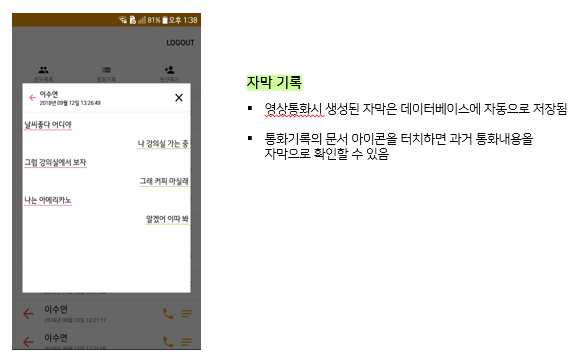

# 졸업작품프로젝트 YourVoice(부제 : 너목보) (2017/12 ~ 2018/11)

## 영상통화 자막제공 앱

 

개요 : 유튜브는 2월 26일 영어 생방송에 자동으로 영문 자막을 붙여주는 기능을 선보였다. 페이스북 역시 작년 6월부터 라이브 방송에 자막 서비스를 제공하기 시작했다. 라이브 방송에서 나오는 언어 음성이 텍스트 형태로 영상에 입혀지는 방식으로 이번 기능을 통해 기존 페이스북 라이브 이용자들은 물론 청각장애인 시청자도 라이브 방송을 편리하게 볼 수 있게 되었다. 유튜브와 페이스북이 동영상 콘텐츠, 라이브 방송을 좀 더 많은 사용자에게 편리하게 제공하는 것처럼 우리역시 일상생활에서 영상통화 이용자들에게 편리함을 제공하고자 한다.

 

### 최종 개발 모습

1. 음성인식

   

 

2. 자막 기록

   

 

3. 사진 전송

   

 

4. 텍스트 메시지

   

 

-----------------------------------------------------------------------------------------------------------------------------------------------------------

### ROLE

1. 음성인식 적용

2. 통화기록 저장

   - 영상통화시 발생하는 모든 정보 저장(자막 기록, 수신자, 발신자)

   - Firebase 연동

3. UI/UX 

   - 영상통화시와 통화기록 확인시, 자막의 UI/UX
   - ListView 

 

---------------------------------------------------------------------------------------------------------------------------------------

### 최종 구현 영상

- <https://drive.google.com/drive/folders/1RV4HOfTxwmoomSA7jSUwFE2yCheqNwUb>